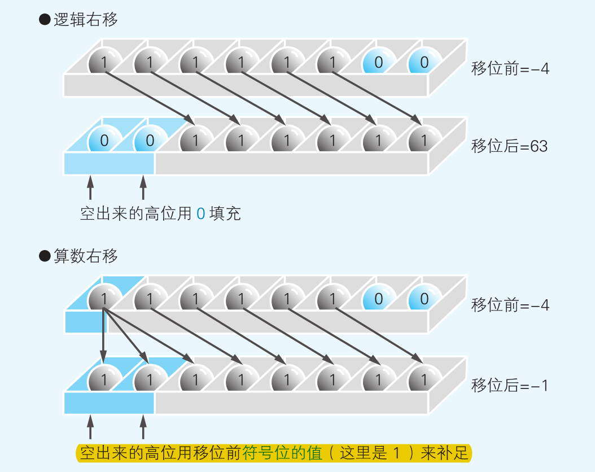

# 计算机组成原理笔记

## 机器字长、MAR、MDR

机器字长是指计算机中一次能够处理的二进制数据的位数，通常以比特（bit）为单位。它决定了计算机能够处理的最大数据量和精度。

MAR（Memory Address Register）位数是指计算机中用于存储内存地址的寄存器的位数。MAR的位数决定了计算机能够**寻址**的最大内存容量。

MDR（Memory Data Register）位数是指计算机中用于存储从内存中读取的数据的寄存器的位数。MDR的位数决定了计算机能够**一次读取**的最大数据量。

它们之间的联系是，MAR和MDR都是与计算机内存相关的寄存器，而机器字长则是决定了计算机能够处理的最大数据量和精度，同时也影响了MAR和MDR的位数。一般来说，机器字长越大，MAR和MDR的位数也会越大，从而能够处理更大的内存容量和更多的数据。

## 位、字节、字、字长、存储单元

> https://katya.blog.csdn.net/article/details/124106536?spm=1001.2101.3001.6661.1&utm_medium=distribute.pc_relevant_t0.none-task-blog-2%7Edefault%7ECTRLIST%7EPayColumn-1-124106536-blog-106456371.pc_relevant_3mothn_strategy_and_data_recovery&depth_1-utm_source=distribute.pc_relevant_t0.none-task-blog-2%7Edefault%7ECTRLIST%7EPayColumn-1-124106536-blog-106456371.pc_relevant_3mothn_strategy_and_data_recovery&utm_relevant_index=1

> https://blog.csdn.net/qq_43627631/article/details/106456371

助记一下：

* 位(bit)：一粒花生米，每一粒=一个二进制位 0/1
*  一个字节B(Byte)：拥有8粒花生米的一勺花生米
*  字：我(CPU)一次能吃下(能处理)一勺或几勺花生米(一个字节或几个字节)
*  字长：我(计算机)一次吃下(处理的)这几勺里一共有多少粒(多少位数)花生米

官方一点：

### 1、位(bit)

bit，是计算机中最小的数据单位，使用二进制，只能表示0和1，在硬件上利用高电压和低电压两种信号实现。

### 2、字节(Byte, B)

 一个字节由8位组成，从0000 0000到1111 1111，转换为十进制为0-255，一共256个数字。它是存储空间的基本计量单位。

### 3、字(word)

是CPU一次能够处理数据位数的最大值。一个字通常由多个字节组成，和字长密切相关。因此，字一定为字节的整数倍。**字的位数称为字长**（注意：字不等于字长乘以字节！字=**字长×位**）。

> 在计算机中，一个字（word）是指计算机能够一次处理的二进制数据的位数。字长（word length）是指一个计算机处理器一次能够处理的二进制数据的位数，通常是16位、32位或64位。位（bit）是计算机中最小的数据单位，只能表示0或1两种状态。
>
> 因此，字 = 字长 * 位，表示一个字的位数等于字长乘以每个位的位数。例如，一个32位的计算机，每个位的位数是1，那么一个字的位数就是32。同样地，一个64位的计算机，每个位的位数是1，那么一个字的位数就是64。

 比如一个8位的CPU，这里的8位指其**字长为8位**，即单位时间内可以处理8位二进制数，即一个字节数。现在的CPU大部分为64位，即单位时间内可以处理64位二进制数，即8个字节数；

>  在计算机系统中，总线以固定大小的一块数据进行传输，这一块的数据也称为字(word)，如今的计算机一般是32位和64位的，这里的位数则是指总线进行数据传输时一块数据的内存大小，也就是前面字的大小。

> 32位的计算机中：32位(bit)=4字节(byte)=1字(word)
> 64位的计算机中：64位(bit)=8字节(byte)=1字(word)

**由此可见，在不同位数的计算机中，一个字的大小也是不同的，所以一个字等于多少字节，是多少位，与计算机的系统硬件有关,不可以错误的对一个字是几字节下固定的判断。**

### 4、字长

 又称作“机器字长”，顾名思义，就是字的长度，这里的长度用位来表示。

64位CPU的字长就是64位、32位CPU的字长就是32位。

### 5、存储单元

存储单元是计算机中存储数据的最小单位。通常是一个字节(byte)或一个字(word)。

### 6、存储字和存储字长

存储字：即一个存储单元中存储的一个具体的二进制代码组合。存储字可以表示一个字符、数字或其他数据。

存储字长：即一个存储单元可存放的最大二进制位数，位数一般等于MDR大小。

### 7、存储矩阵

存储矩阵是指计算机中存储数据的一种方式，通常是一个二维数组。存储矩阵可以用于存储图像、音频、视频等数据。每个元素都是一个存储字，可以表示一个像素、采样值或其他数据。

## 按字编址和按字节编址

* 按字编址是指每个内存地址存储一个字（通常是16位或32位），也就是说，每个内存地址只能存储一个完整的字。这种方式的优点是访问速度快，因为每次读取或写入数据只需要一个内存地址。但是，它的缺点是浪费空间，因为如果要存储的数据不足一个字，那么剩余的空间就会浪费掉。

* 按字节编址是指每个内存地址存储一个字节（通常是8位），也就是说，每个内存地址可以存储一个字节或多个字节。这种方式的优点是节省空间，因为可以更好地利用内存空间。但是，它的缺点是访问速度相对较慢，因为每次读取或写入数据需要多个内存地址。

总的来说，按字编址适用于需要快速访问数据的场景，而按字节编址适用于需要节省内存空间的场景。

## 时钟周期和频率

时钟周期：是指计算机中的一个基本时间单位，它通常是CPU时钟的一个周期。频率是指在单位时间内发生的周期数。因此，时钟周期的倒数就是频率，即每秒钟发生的时钟周期数，也就是CPU的时钟频率。例如，如果CPU的时钟频率为2 GHz，那么每秒钟会发生2亿个时钟周期。因此，时钟周期的倒数就是2 GHz，即**每秒钟2亿个时钟周期**。

频率：在CPU这个复杂的数字系统中，为了确保内部所有硬件单元能够协同快速工作，CPU架构工程师们往往会设计一套时钟信号与系统同步进行操作。**时钟信号是由一系列的脉冲信号构成，并且总是按一定电压幅度、时间间隔连续发出的方波信号，它周期性地在0与1之间往复变化**。如下图所示。


在第一脉冲和第二个脉冲之间的时间间隔称之为周期，它的单位是**秒（s）**。但**单位时间1s内所产生的脉冲个数称之为频率**，频率的最基本计量单位就是赫兹Hz。

时钟频率（f）与周期（T）两者互为倒数：f=1/T

这个公式表明的就是**频率表示时钟在1秒钟内重复的次数**，而目前的CPU普遍已经处于GHz(10^9)级，也就是说每秒钟产生**10亿个脉冲信号**。

> 1KHz =  10^3Hz   
>
> 1MHz =  10^3KHz   = 10^6Hz   
>
> 1GHz =  10^3MHz      = 10^9Hz   

注意区分：一个**时钟周期**(以秒为单位)和完成一个任务所需要的**时钟周期数**(以个数为单位)

告诉大家一个更容易理解的方式吧。机器内部的时钟周期就是机器世界的时间单位。比如我们现实世界的时间单位是分钟、秒、毫秒等。只不过机器世界就一个时间单位叫时钟周期，而为了人类更方便理解这个指标就用现实世界的秒来表示，即每秒多少时钟周期，即多少HZ。

## CPI


## 指令集

从零开始开发一个CPU的指令集是非常困难的，需要深入了解计算机体系结构和数字电路设计。以下是一些需要考虑的方面：

1. 指令集架构：需要确定指令集的类型，例如RISC或CISC，并确定指令的格式和操作码。

2. 指令执行：需要设计电路来执行每个指令，包括算术逻辑单元、寄存器、存储器和控制单元。

3. 数据通路：需要设计数据通路来传输数据和指令，包括总线、寄存器和存储器。

4. 测试和调试：需要编写测试程序和调试工具来验证CPU的正确性和性能。

总之，从零开始开发一个CPU的指令集需要深入的计算机体系结构和数字电路设计知识，需要耗费大量的时间和精力。

## 秒

1 秒 = 1000 毫秒 = 1000 * 1000 微秒 = 1000* 1000* 1000 纳秒 = 1000 * 1000 * 1000 *1000 皮秒

1s =      10^3ms =           10^6us          = 10^9ns                           = 10^12ps

## CPU时间


## 机器码


## MIPS


## 移位

只有在**右移**时才必须区分逻辑位移和算术位移。左移时，无论是图形模式（逻辑左移）还是相乘运算（算术左移），都只需在空出来的低位补 0 即可。



## 补码

> [补码是谁发明的，它的最初作用是什么?](https://www.zhihu.com/question/36667166)

补码的提出是为了省去计算机判断[加减运算](https://www.zhihu.com/search?q=%E5%8A%A0%E5%87%8F%E8%BF%90%E7%AE%97&search_source=Entity&hybrid_search_source=Entity&hybrid_search_extra=%7B%22sourceType%22%3A%22answer%22%2C%22sourceId%22%3A950165108%7D)的麻烦。

但是补码为什么要定义成这样，为什么一个刻意的、人为的东西能够在数学运算中完美地自洽？最近重学微机原理，几番思索之后，我决定试着从另外一个角度来探索一下。

**一、从加法中思考刻度值是个啥**

让我们回顾一下数学里的加法。

首先画一个数轴①。数轴上有好多点，我们最关心的其实是他们各自在数轴上的位置，所以给他们起的名字最好就包含他们的位置信息。所以我们随便找一个点设为0点，然后其他所有的点与0点的距离就当作他们的名字。


图1-1 数轴①

1+2就是在刻度1处向数轴正方向移动两个单位到3处，所以1+2=3

1-2=1+（-2）就是在1处向数轴负方向移动两个单位到-1，所以1-2=-1

在标准数轴上的运算可以看作为：

```text
刻度名 移动方向 移动距离 = 另一个刻度名
num1   operator  num2    =    result
```

此时我们下一个定义：**数轴上的每个点的名字，用该点到原点的距离来命名。称每个点的名字为刻度值。**

注意啦，[加法算式](https://www.zhihu.com/search?q=%E5%8A%A0%E6%B3%95%E7%AE%97%E5%BC%8F&search_source=Entity&hybrid_search_source=Entity&hybrid_search_extra=%7B%22sourceType%22%3A%22answer%22%2C%22sourceId%22%3A950165108%7D)中的两个操作数虽然都是数字，但是含义完全不一样，左操作数是刻度的名字，而命名规则是其与原点的相对距离；而右操作数则是一个有实际几何意义的长度量。

**尽管刻度值是用距离来命名的，但是，它归根结底只是个名字，是个代号，它本身没有量纲，没有距离的含义。**

**二、机器码**

让我们再来看一下计算机中的[加法数轴](https://www.zhihu.com/search?q=%E5%8A%A0%E6%B3%95%E6%95%B0%E8%BD%B4&search_source=Entity&hybrid_search_source=Entity&hybrid_search_extra=%7B%22sourceType%22%3A%22answer%22%2C%22sourceId%22%3A950165108%7D)，以4位计算机的数轴为例。

计算机的世界里只有1和0，那么计算机怎样给数轴上的刻度起名呢？就从0000开始嘛，每右移一个单位长度，就在名字上加一就行了嘛。所以就有了如下形式的数轴。下面数轴记作数轴。


图2-1 4位计算机数轴

图2-1的数轴很符合计算机的认知习惯，毕竟计算机只认0和1，连[正负号](https://www.zhihu.com/search?q=%E6%AD%A3%E8%B4%9F%E5%8F%B7&search_source=Entity&hybrid_search_source=Entity&hybrid_search_extra=%7B%22sourceType%22%3A%22answer%22%2C%22sourceId%22%3A950165108%7D)都没有，所以自然不能在刻度值上体现出正负来，于是把原点放在数轴的最左端，也就不必表示负数了。另外需要注意的一件事就是，**计算机的数轴并不是向两端无限延伸的，而是有尽头的。**

这条数轴的刻度值就称为机器码。

但是咱们人类看[二进制](https://www.zhihu.com/search?q=%E4%BA%8C%E8%BF%9B%E5%88%B6&search_source=Entity&hybrid_search_source=Entity&hybrid_search_extra=%7B%22sourceType%22%3A%22answer%22%2C%22sourceId%22%3A950165108%7D)机器码实在是太费劲了，让我们还是把人类给各个刻度起的十进制名字表上吧。于是就有了下图，将下图的数轴记作数轴①。


图2-2 数轴①

在实际计算中1111+1=10000，但本文中的计算机只有4位，所以最高位的1就被丢掉了，于是，1111沿正方向的下一个刻度是0000。为了体现这一点，我们对数轴做一点改动。不妨就让1111和0000接上，于是有了下图。记作数轴②。


这样一来，1111沿正方向的下一个刻度是0000的现象不就表现的很好了吗。顺便，我们也不管向右为正方向了，管顺时针叫正方向吧。

可是，另一个问题就随之而来了：原本的数轴①原点的负方向上是没有点的，可变成数轴②之后，负方向上就有点了。这样一来，要想表示“负方向”这个概念该怎么办呢？

**三、让计算机计算负数**

为了让计算机能表示正负，所以不妨就用二进制数的最高位来代表正负号吧，其他位就按照正常的二进制数来表示数值，这当然是一个很自然的想法。0001在0000的正方向，那它肯定是正数了，其最高位是0，那就让最高位为0的表示正数刻度吧；1111在0000的负方向上，那它肯定是负数了，其最高位时1，那就让所有最高位为1的表示[负数刻度](https://www.zhihu.com/search?q=%E8%B4%9F%E6%95%B0%E5%88%BB%E5%BA%A6&search_source=Entity&hybrid_search_source=Entity&hybrid_search_extra=%7B%22sourceType%22%3A%22answer%22%2C%22sourceId%22%3A950165108%7D)吧。这样一来就有了下图数轴。


图3-1 带符号数数轴

可是这样吧，问题也是显而易见的：

对比数轴①可以发现，数轴②上只有正数的点值是其坐标值，因此，我们平常意义上的加减运算只在正数部分生效，而在负数部分失效。

- 第一就是原点负方向上相邻的刻度的名字，并不符合咱们文章开始的标准[数轴加减运算](https://www.zhihu.com/search?q=%E6%95%B0%E8%BD%B4%E5%8A%A0%E5%87%8F%E8%BF%90%E7%AE%97&search_source=Entity&hybrid_search_source=Entity&hybrid_search_extra=%7B%22sourceType%22%3A%22answer%22%2C%22sourceId%22%3A950165108%7D)法则。但是正数部分倒是蛮符合。

```text
刻度名 移动方向 移动距离 = 另一个刻度名
num1   operator  num2    =    result    #不符合啦
```

- 第二就是这数轴上咋有俩0呢，还是0和-0，这个-0是什么鬼。

为了解决上面这两个问题，咱们只能一种思路了。

**四、补码**

那咱们还是根据第一节的那个定义来起名字吧。

> 此时我们下一个定义：**数轴上的每个点的名字，用该点到原点的距离来命名。称每个点的名字为刻度值。**                                                               ——第一节的定义

这么一来，正数部分也就是0000~0111的十进制名字是不需要修改的。那咱们就改一下负数部分吧。

既然1111是原点负方向的相邻点，两者距离一个单位长度，所以不妨就称其为-1吧。那么以此类推，我们就有了另一个数轴：


图4-1 十进制补码数轴

这条数轴上的带符号十进制数就被咱们称为同刻度上的机器码的补码。

需要解释的是1000这个点，为什么设定它的补码为-8，而不是+8呢？因为前面咱们约定了机器码最高位表示符号嘛，虽然它在7的正方向上，但是，它最高位是1，所以它是个负数。按次序，它的补码只能是-8。

可这样的命名的话，就完全抛开了原码。但我们希望让机器能从原码算出其补码。

于是我们用第三节开头的方法来把十进制补码“换算”称“带符号二进制数”，看看能不能找到补码和原码之间的关系。显而易见的是：在正数部分补码和原码是相同的。那么我们主要把注意力放在负数部分上。

> 为了让计算机能表示正负，所以不妨就用二进制数的最高位来代表正负号吧，其他位就按照正常的二进制数来表示数值，这当然是一个很自然的想法。                 ——本文第三节开头


图4-2 外侧为机器原码，内侧为补码。

让我们来观察整个数轴的左半部分


图4-3

不知道大家发现了没有，这半部分的原码和补码就是排列顺序反了一下！


图4-4 左半部分的原码最上面的第一个和补码的最下面的第一个一样。原码第二个和补码第二个也一样……

说到顺序变反，不知道大家想到另外一个东西了没？对就是反码。

**五、反码**

反码的作用体现在数轴上的作用就是位置反置：


图5-1 反码数轴

上图可看出，左边的红框内的[负数原码](https://www.zhihu.com/search?q=%E8%B4%9F%E6%95%B0%E5%8E%9F%E7%A0%81&search_source=Entity&hybrid_search_source=Entity&hybrid_search_extra=%7B%22sourceType%22%3A%22answer%22%2C%22sourceId%22%3A950165108%7D)和反码的顺序各自彼此相反。但是在补码数轴上原码1111对应的补码是1001；而反码数轴上原码1111对应的是1000，等等......每一个数字都比补码错后了1位。于是，我们就找到了补码和原码之间的关系：原码-(取反)→反码-(加1)→补码

**六、进借位与溢出**

我们上述一系列操作，最终得出补码数轴，是因为补码数轴上可以进行带符号数的加减运算。

如果运算顺时针经过-8则说明发生了进位；如果逆时针经过-8，则说明发生了借位。当有负数参与运算时，结果如果小于-8，则超出补码的表示范围导致结果无效；同样的，当正数参与运算时，结果大于7，也会超出补码表示范围。

对比补码数轴和[原码数轴](https://www.zhihu.com/search?q=%E5%8E%9F%E7%A0%81%E6%95%B0%E8%BD%B4&search_source=Entity&hybrid_search_source=Entity&hybrid_search_extra=%7B%22sourceType%22%3A%22answer%22%2C%22sourceId%22%3A950165108%7D)，不难发现，两个数轴的最左端刻度名不同，原码轴的最左端刻度名是+0即0000点，而补码轴的最左端刻度名是-8即1000。

当原码对应的二进制数运算时，超过0000点则会出错。而在补码轴上运算时则不会，因为一切在补码轴上经过0000点的运算的符号位都会因进位而丢失，从而保证在补码轴上的运算始终正确。

提出补码，本质上是为了解决一个问题：[有符号数](https://www.zhihu.com/search?q=%E6%9C%89%E7%AC%A6%E5%8F%B7%E6%95%B0&search_source=Entity&hybrid_search_source=Entity&hybrid_search_extra=%7B%22sourceType%22%3A%22answer%22%2C%22sourceId%22%3A950165108%7D)原码数轴的坐标值与该坐标到原点的距离不对应导致的不能进行加减运算的问题。

而这个问题其实是定义变量名及其值不规范导致的。举个例子，1111B等于15，但我们非得要用它表示-7，即def 1111B -7，但是参与运算的却是15而不是-7。

回看补码的定义， 


在x<0中， 2^n 在原码轴上就是+0点，显然，求补运算就是计算出机器码表示的有符号数的坐标值。

## 无法精确表示小数


因为无法正确表示的数值，最后都变成了近似值。计算机这个功能有限的机器设备，是无法处理无限循环的小数的。因此，在遇到循环小数时，计算机就会根据变量数据类型所对应的长度将数值从中间截断或者四舍五入。我们知道，将 0.3333…这样的循环小数从中间截断会变成 0.333333，这时它的 3 倍是无法得出 1 的（结果是0.999999），计算机运算出错的原因也是同样的道理。

## 程序访问的局部性原理

程序访问的局部性原理是指程序在执行过程中，对于数据和指令的访问往往具有一定的局部性特征，即程序在一段时间内对某些数据或指令的访问频率比其他数据或指令更高。局部性原理主要包括以下三种：

1. 时间局部性：指程序在一段时间内对某些数据或指令的访问频率比其他数据或指令更高。例如，循环语句中的变量在每次循环中都会被访问，因此具有时间局部性。

2. 空间局部性：指程序在访问某个数据或指令时，往往会连续地访问其附近的数据或指令。例如，数组中相邻的元素在内存中也是相邻的，因此具有空间局部性。

3. 块局部性：指程序在访问某个数据或指令时，往往会一次性地访问一块连续的数据或指令。例如，程序中的函数通常会一次性地加载到内存中，因此具有块局部性。

局部性原理的存在使得计算机系统可以通过缓存、预取等技术来提高程序的执行效率，从而提高计算机系统的整体性能。

## 寄存器

问：计算机每秒有几亿次运算，但是寄存器数量只有几十或几百个，寄存器能忙得过来吗？

寄存器是计算机中最快的存储器件，它们能够在一个时钟周期内完成读写操作。虽然计算机每秒可以进行数亿次运算，但是这些运算并不都需要寄存器参与。通常情况下，只有一小部分运算需要使用寄存器，而且寄存器的数量也足够满足这些需要。因此，寄存器能够轻松地处理计算机中需要使用它们的任务。

问：计算机中的数都保留在寄存器中，如果我定义了1万个变量，存放1万个不同的数字，并且同时都需要，但是寄存器的个数是有限的，计算机如何解决这个问题的？

当计算机中的寄存器不足以存储所有变量时，计算机会使用内存来存储这些变量。内存是一种比寄存器更大但速度较慢的存储设备，可以存储大量的数据。在程序运行时，需要使用的变量会被加载到内存中，当不再需要时，会被释放掉。因此，即使有很多变量需要同时使用，计算机也可以通过使用内存来解决这个问题。

## 原码反码补码

* 原码表示法是带符号的绝对值表示

## 单片机、树莓派、机器人

 单片机、树莓派和机器人是三个不同的概念，它们之间有一些区别和联系。

单片机是一种集成电路，它包含了中央处理器、存储器、输入/输出接口和时钟等基本组件，可以用来控制各种电子设备。单片机通常用于嵌入式系统中，例如家电、汽车、医疗设备等。

树莓派是一种基于Linux操作系统的微型计算机，它包含了中央处理器、存储器、输入/输出接口、网络接口等组件，可以用来运行各种软件应用程序。树莓派通常用于教育、娱乐、智能家居等领域。

机器人是一种能够自主执行任务的机械设备，它可以通过传感器、控制系统和执行机构等组件来感知环境、做出决策和执行动作。机器人通常用于工业、服务、探索等领域。

它们之间的联系在于，单片机和树莓派都可以用来控制机器人的运动和行为。例如，可以使用单片机来控制机器人的电机和传感器，也可以使用树莓派来运行机器人的软件程序。此外，树莓派也可以作为机器人的大脑，通过连接各种传感器和执行机构来实现自主控制。

总之，单片机、树莓派和机器人是三个不同的概念，它们之间有一些区别和联系，但都可以用来实现各种有趣的项目和应用。

## Arduino与单片机区别

单片机是一个超级小型的电脑。

[Arduino](https://link.zhihu.com/?target=http%3A//mc.dfrobot.com.cn/portal.php%3Fmod%3Dtopic%26topicid%3D1)是一套标准，包括了软件和硬件的设计标准。（类似80年代IBM提出的PC概念）

Arduino里的硬件部分是由单片机来实现的。

ARDUNIO就是加强版的单片机，功能更强大，使用更简单。

arduino是带软硬件接口，更便于使用和二次开发的单片机 最重要的还是它软硬件开源使扩展性增加了，这是最大的区别吧。

Arduino 的厉害之处在于它资源丰富，随便搜一个传感器+arduino，在google上都有一堆的软件可以借鉴。

Arduino不需要自己画板子，买模块拼接就能把项目做出来。不像单片机开发板，自己买回来倒腾了半天，原型还不一定能打出来

## 人脑中的神经元与电脑中的晶体管

我们的大脑由1000亿个称为神经元的细胞组成，这些细胞用于思考和记忆事物。[计算机](https://link.zhihu.com/?target=http%3A//www.hqchip.com/app/873)也一样，也有数十亿个名为[晶体管](https://link.zhihu.com/?target=http%3A//www.hqchip.com/app/970)的微小脑细胞。。[晶体](https://link.zhihu.com/?target=http%3A//www.hqchip.com/app/330)管已经由JohnBardeen，WalterBrattain和Willi[amS](https://link.zhihu.com/?target=http%3A//www.elecfans.com/tags/ams/)hockley进行了半个多世纪的设计，并成功地研制了出来，且目前晶体管技术仍然在不断地突破，更新。晶体管的诞生和发展，从根本上影响了电力电子学。

晶体管（transistor）是一种固体半导体器件（包括[二极管](https://link.zhihu.com/?target=https%3A//baike.baidu.com/item/%25E4%25BA%258C%25E6%259E%2581%25E7%25AE%25A1/102466)、[三极管](https://link.zhihu.com/?target=https%3A//baike.baidu.com/item/%25E4%25B8%2589%25E6%259E%2581%25E7%25AE%25A1/148491)、[场效应管](https://link.zhihu.com/?target=https%3A//baike.baidu.com/item/%25E5%259C%25BA%25E6%2595%2588%25E5%25BA%2594%25E7%25AE%25A1/151400)、[晶闸管](https://link.zhihu.com/?target=https%3A//baike.baidu.com/item/%25E6%2599%25B6%25E9%2597%25B8%25E7%25AE%25A1/281255)等，有时特指双极型器件），具有检波、[整流](https://link.zhihu.com/?target=https%3A//baike.baidu.com/item/%25E6%2595%25B4%25E6%25B5%2581/5428170)、放大、开关、稳压、[信号](https://link.zhihu.com/?target=https%3A//baike.baidu.com/item/%25E4%25BF%25A1%25E5%258F%25B7)调制等多种功能。晶体管作为一种可变电流开关，能够基于输入电压控制输出电流。与普通机械开关（如Relay、switch）不同，晶体管利用电信号来控制自身的开合，所以开关速度可以非常快，实验室中的切换速度可达100GHz以上。

2016年，劳伦斯伯克利国家实验室的一个团队打破了物理极限，将现有的最精尖的晶体管制程从14nm缩减到了1nm，完成了计算技术界的一大突破。