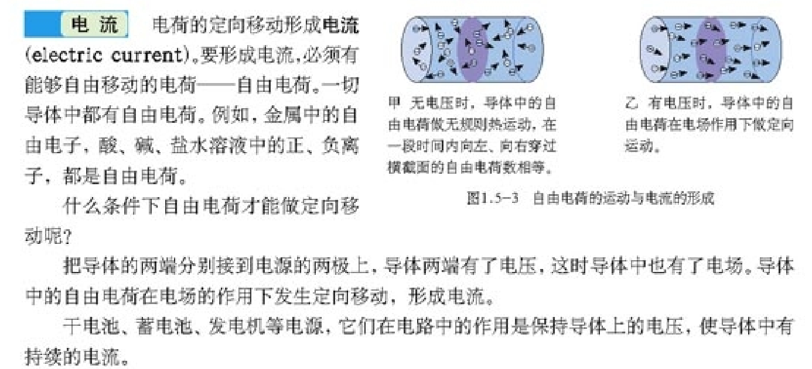

# 数电模电有关笔记

> 如下为高中物理电磁学复习

## 常见基本粒子

* 分子: 多个原子相互作用形成的稳定体系。
  * 原子
    * 原子核
      * 中子: 一种由一个u夸克，两个d夸克组成的粒子(处在基态)。
      * 质子: 一种由两个u夸克，一个d夸克组成的粒子(处在基态)。
    * 电子: 一种带电为-e的基本粒子，不参与强相互作用。

离子: 失去一个或几个最外层电子的原子。

夸克: 参与强相互作用粒子的最小单元，是基本粒子，有6种(味道)，最常见的是u夸克(带电+2e/3)和d夸克(带电-e/3)。

量子: 不是某个粒子，是一个概念，狭义上指能量取值不连续的体系。

## 正电负电

> https://www.zhihu.com/question/22950434

初中时候一学电就已经告诉过你电荷的正负只是人为规定的这件事了嘛~

电荷的正负，物理学上有规定，就是用丝绸摩擦过的玻璃棒带正电荷，用毛皮摩擦过的橡胶棒带负电荷。
再根据电荷相互作用，即同种相斥，异种相吸，就可以判断一个物体带电如何了。

>  米国科学家富兰克林对电荷做出**规定**：绸子摩擦过的玻璃棒所带电荷叫做正电荷，毛皮摩擦过的橡胶棒所带电荷叫做负电荷。

至于质子为正，电子为负……是因为质子带的电跟绸子摩擦过的玻璃棒所带电荷一样而电子带的电跟毛皮摩擦过的橡胶棒所带电荷也一样哇。

## 物质

## 库伦

库仑（英文：Coulomb），是表示[电荷量](https://baike.baidu.com/item/%E7%94%B5%E8%8D%B7%E9%87%8F/5728792?fromModule=lemma_inlink)的单位，简称库，符号C。它是为纪念法国物理学家[查利·奥古斯丁·库仑](https://baike.baidu.com/item/%E6%9F%A5%E5%88%A9%C2%B7%E5%A5%A5%E5%8F%A4%E6%96%AF%E4%B8%81%C2%B7%E5%BA%93%E4%BB%91/7216417?fromModule=lemma_inlink)而命名的。

定义：若导线中载有1[安培](https://baike.baidu.com/item/%E5%AE%89%E5%9F%B9/5489921?fromModule=lemma_inlink)的稳定电流，则在1秒内通过导线[横截面](https://baike.baidu.com/item/%E6%A8%AA%E6%88%AA%E9%9D%A2/3338627?fromModule=lemma_inlink)的电量为1库仑。

库仑是[电荷量](https://baike.baidu.com/item/%E7%94%B5%E8%8D%B7%E9%87%8F?fromModule=lemma_inlink)单位，简称库，用C表示。它是为纪念法国物理学家库仑（Charles-Augustin de Coulomb, 1736～1806）而命名的。库仑不是[国际单位制](https://baike.baidu.com/item/%E5%9B%BD%E9%99%85%E5%8D%95%E4%BD%8D%E5%88%B6?fromModule=lemma_inlink)基本单位，而是国际单位制导出单位。1库仑=1[安培](https://baike.baidu.com/item/%E5%AE%89%E5%9F%B9/5489921?fromModule=lemma_inlink)·1秒，即1C=1A·s。

## 电荷守恒

> 问：元电荷本身并无正负，那为什么说质子带一个单位的正的元电荷，电子带一个单位负的元电荷。?
>
> 答：注意：元电荷既不是电子，也不是质子，它只是[最小电荷量](https://www.zhihu.com/search?q=%E6%9C%80%E5%B0%8F%E7%94%B5%E8%8D%B7%E9%87%8F&search_source=Entity&hybrid_search_source=Entity&hybrid_search_extra=%7B%22sourceType%22%3A%22answer%22%2C%22sourceId%22%3A2367532496%7D)在数值上等于电子或质子而已。

## 电场

电场是电荷及变化磁场周围空间里存在的一种特殊物质。这种物质与通常的实物不同，它虽然不是由分子原子所组成的，但它却是[客观存在](https://baike.baidu.com/item/%E5%AE%A2%E8%A7%82%E5%AD%98%E5%9C%A8/8670991?fromModule=lemma_inlink)的特殊物质，具有通常物质所具有的力和能量等客观属性。 [1] 

电场的力的性质表现为：电场对放入其中的电荷有[作用力](https://baike.baidu.com/item/%E4%BD%9C%E7%94%A8%E5%8A%9B/9884994?fromModule=lemma_inlink)，这种力称为[电场力](https://baike.baidu.com/item/%E7%94%B5%E5%9C%BA%E5%8A%9B/1845623?fromModule=lemma_inlink)。电场的能的性质表现为：当电荷在电场中移动时，电场力对电荷做功，说明电场具有能量。

19世纪30年代,英国科学家法拉第提出了“电荷的周围存在着由它产生的电场”这一观点，随后物理学理论和实验不仅证实了法拉第的这一观点，而且证明了电场是一种客观存在的物质形式。电场是看不见、摸不着的，为了形象地描述电场中各点[电场强度](https://baike.baidu.com/item/%E7%94%B5%E5%9C%BA%E5%BC%BA%E5%BA%A6/634706?fromModule=lemma_inlink)的大小和方向，法拉第还引入了[电场线](https://baike.baidu.com/item/%E7%94%B5%E5%9C%BA%E7%BA%BF/9498182?fromModule=lemma_inlink)的概念。 [8] 

[带电体](https://baike.baidu.com/item/%E5%B8%A6%E7%94%B5%E4%BD%93/10982306?fromModule=lemma_inlink)周围存在的特殊物质。电场的基本性质是对放入其中的电荷有力的作用。电荷间的作用总是通过电场进行的。

## 电荷、电子、电流

电子是一种基本粒子，是构成原子的组成部分之一，带有**负电荷**。而电荷是指物体所带的电性属性，可以是正电荷、负电荷或中性。电子是带有负电荷的粒子，是电荷的一种表现形式。

**电荷的定向移动形成电流**。**规定正电荷的移动方向，为电流的方向。**电流是表示电流强弱的物理量，用I表示，单位是安培，简称安，符号是A。

> 电流方向是在没有发现电子以前定义的，科学家们曾经认为电流是正电荷从电源的正极经导线流向负极的。

现在，人们已经知道**金属导体中的电流是由带负电的电子的移动产生的**，它们是从**电源的负极**经导线流向正极，电子的移动方向与电流的方向正好相反。

## 灯泡发光

通过学习我们知道，小灯泡发光是因为有电流持续流过小灯泡，从能量分析，就是运动的电荷对灯泡做功，将电能转化为光能（热能）的过程。

通过实验可以观测出，同一个小灯泡接在不同的电路中，明、暗不同，这是因为流过小灯泡的**电流****的强弱**不同。

## 电流强弱

表示电流强弱的物理量是电流。

电流通常用符号I表示，电流的单位是安培，简称安，符号是A。

电流是一个比较大的单位，常用到的电流单位还有毫安（mA）和微安（μA）。

毫安和微安，与安培间满足计算式：

1mA=10-3A

1μA=10-6A

我们经常这样来描述电流：在电路图中流过小灯泡的电流是0.2安培。

## 电压

电流之所以能够在导线中流动，也是因为在电流中有着高电势和低电势之间的差别。这种差别叫电势差，也叫电压。换句话说。在电路中，任意两点之间的电位差称为这两点的电压。通常用字母V代表电压。

电源是给用电器两端提供电压的装置。电压的大小可以用电压表（符号：V）测量。

## 电动势

## 电压与电势区别

电势是指在电场中某一点的电势能与电荷量之比，通常用符号V表示，单位是伏特（V）。电势是一个标量，它描述了电场对电荷的作用力大小，但不涉及电荷在电场中的运动方向。电势是一个相对值，通常以某一点为参考点，该点的电势被定义为零。

电压是指电场中两点之间的电势差，通常用符号U表示，单位也是伏特（V）。电压是一个标量，它描述了电场中两点之间的电势能差异，即电荷从一个点移动到另一个点所需的能量。电压是一个绝对值，它没有参考点，但通常将地球作为电势的参考点。

因此，电势和电压的区别在于，电势是描述电场中某一点的电势能与电荷量之比，而电压是描述电场中两点之间的电势差。

## 电池

储存电能的电池有干电池、蓄电池、可充电池等，燃料电池和太阳能电池主要是转换电能而不是储存电能。电子在导体中运动形成了电流，释放电能、可以在回路中做功，因此，**人们容易误解成、电池就是储存电子的容器**。

电池的内部是化学反应，它是推拉正负极板当中的自由电子运动，在回路中形成电流，电池的电量不足就是推动能力的下降，给电池充电就是补充它的推动力，不是储存电子的过程。我们可以举例说明其中的道理，在门窗紧闭的房间内，感觉不到空气的流动，打开电风扇就会出现风，**对应电池来说：空气是自由电子、风是电流，电风扇的作用就是化学物质**，真空环境如同绝缘材料，电风扇的转动也就无法吹出风。

## 欧姆定律

在同一电路中，导体中的电流跟导体两端的电压成正比，跟导体的电阻成反比,这就是欧姆定律。欧姆定律及其公式的发现，给电学的计算，带来了很大的方便。人们为纪念他，将电阻的单位定为欧姆(简称“欧”，符号为Ω)。 简称“欧”，符号为Ω。