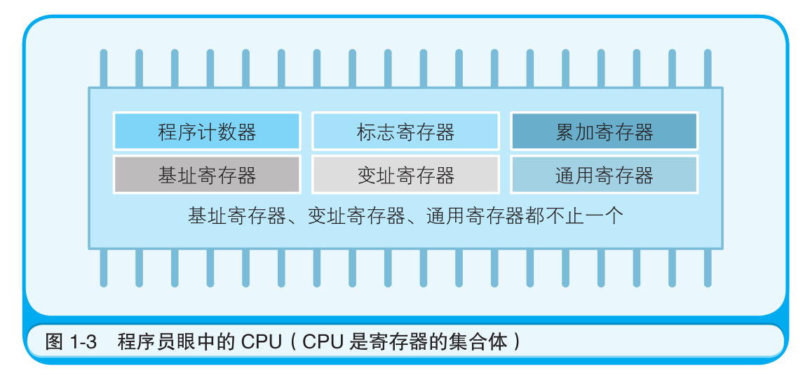

# 汇编语言笔记

## 有关文章

[学完80x86汇编语言之后可以做哪些有意思的事情？](https://www.zhihu.com/question/37295606/answer/74326243)

## 书中重要内容摘录

- 在CPU中，程序员能够用指令读写的部件只有寄存器，程序员可以通过改变寄存器中的内容实现对CPU的控制。

## 寄存器




8086 CPU中有14个寄存器，它们分为三类：**通用寄存器**、**段寄存器**和**指令指针寄存器**。

* 通用寄存器：
  * **AX**：累加器，用于算术和逻辑运算，以及存储一些临时数据。
  * **BX**：基址寄存器，用于存储内存地址，通常用于访问数据段中的数据。
  * **CX**：计数器，用于循环和计数操作。
  * **DX**：数据寄存器，用于存储一些临时数据，也用于存储I/O端口的地址。
  * **SI**：源索引寄存器，用于存储源数据的地址。
  * **DI**：目的索引寄存器，用于存储目的数据的地址。
  * **BP**：基址指针寄存器，用于存储栈帧的基地址。
  * **SP**：栈指针寄存器，用于存储栈顶的地址。

* 段寄存器：
  * **CS**：**代码段**寄存器，用于存储代码段的起始地址。
  * **DS**：数据段寄存器，用于存储数据段的起始地址。
  * **ES**：附加数据段寄存器，用于存储附加数据段的起始地址。
  * **SS**：堆栈段寄存器，用于存储堆栈段的起始地址。

* 指令指针寄存器：
  * **IP**：**指令指针**寄存器，用于存储下一条要执行的指令的地址。
  * **FLAGS**：标志寄存器，用于存储CPU的状态信息，如进位标志、零标志、符号标志等。

这些寄存器在8086 CPU中起着非常重要的作用，它们的值可以被CPU读取和修改，以实现各种不同的计算和操作。

> CPU 是具有各种功能的寄存器的集合体。其中，**程序计数器、累加寄存器、标志寄存器、指令寄存器和栈寄存器**都只有一个，其他的寄存器一般有多个。

## 常用指令

* **MOV**：将数据从一个位置复制到另一个位置。

* **ADD**：将两个数相加，并将结果存储在指定的位置。

* **SUB**：将两个数相减，并将结果存储在指定的位置。

* **INC**：将指定位置的值加1。

* **DEC**：将指定位置的值减1。

* **CMP**：比较两个数的值，并根据比较结果设置标志位。

* **JMP**：无条件跳转到指定的地址。

* **JZ**：如果零标志位被设置，则跳转到指定的地址。

* **JE**：如果相等标志位被设置，则跳转到指定的地址。

* **JNE**：如果不相等标志位被设置，则跳转到指定的地址。

* **CALL**：调用一个子程序。

* **RET**：从子程序返回。

* **INT**：触发一个中断。

* **PUSH**：将一个值压入栈中。

* **POP**：将一个值从栈中弹出。

## MIPS汇编语言

 MIPS（Microprocessor without Interlocked Pipeline Stages）是一种基于RISC（Reduced Instruction Set Computing）架构的指令集架构，常用于嵌入式系统和计算机体系结构教学中。MIPS汇编语言是一种基于MIPS指令集的汇编语言，用于编写MIPS架构的程序。

MIPS汇编语言的基本语法结构如下：

```
[label:] instruction [operands] [;comment]
```

其中，label为可选项，用于标识程序中的位置，instruction为MIPS指令，operands为指令的操作数，comment为可选项，用于注释代码。

MIPS汇编语言中的指令可以分为以下几类：

1. 数据传输指令：用于将数据从一个位置传输到另一个位置，如lw（load word）和sw（store word）指令。

2. 算术指令：用于执行算术运算，如add（加法）和sub（减法）指令。

3. 逻辑指令：用于执行逻辑运算，如and（与）和or（或）指令。

4. 分支指令：用于控制程序的流程，如beq（分支相等）和bne（分支不相等）指令。

5. 跳转指令：用于跳转到程序的其他部分，如j（无条件跳转）和jal（跳转并链接）指令。

下面是一个简单的MIPS汇编代码示例，用于计算两个数的和：

```
.data
num1: .word 5
num2: .word 7
sum: .word 0

.text
main:
    lw $t0, num1 # 将num1的值加载到$t0寄存器中
    lw $t1, num2 # 将num2的值加载到$t1寄存器中
    add $t2, $t0, $t1 # 将$t0和$t1的值相加，结果存储到$t2中
    sw $t2, sum # 将$t2的值存储到sum中
    j exit # 跳转到exit标签处

exit:
    li $v0, 10 # 将系统调用号10（退出程序）加载到$v0寄存器中
    syscall # 执行系统调用
```

以上代码中，.data部分定义了三个变量num1、num2和sum，.text部分定义了程序的主函数main和退出函数exit。在main函数中，首先使用lw指令将num1和num2的值加载到$t0和$t1寄存器中，然后使用add指令将$t0和$t1的值相加，结果存储到$t2寄存器中，最后使用sw指令将$t2的值存储到sum变量中。在程序执行完毕后，使用j指令跳转到exit标签处，执行退出函数。在退出函数中，使用li指令将系统调用号10（退出程序）加载到$v0寄存器中，然后使用syscall指令执行系统调用，退出程序。

以上是MIPS汇编语言的基本介绍和使用方法。需要注意的是，MIPS汇编语言的语法结构和指令集架构较为严格，需要仔细阅读相关文档和教程，并进行大量的实践练习，才能熟练掌握。

## 数据常见寻址模式

* 直接寻址：使用数据的地址直接访问数据。
* 间接寻址：使用一个指针或地址来访问数据。
* 寄存器寻址：使用寄存器中的值来访问数据。
* 立即寻址：直接使用指令中的常数值作为数据。
* 相对寻址：使用相对于当前指令地址的偏移量来访问数据。
* 基址寻址：使用一个基地址和一个偏移量来访问数据。
* 变址寻址：使用一个基地址和一个变址寄存器中的值来访问数据。
* 栈寻址：使用栈指针来访问数据。

##  ARM和MIPS

* 指令集架构不同：ARM采用的是RISC指令集架构，而MIPS采用的是MIPS指令集架构。ARM指令集比MIPS指令集更加精简，但MIPS指令集的指令长度更加统一，执行效率更高。

* 应用领域不同：ARM主要应用于移动设备、嵌入式系统和消费电子等领域，而MIPS主要应用于网络设备、数字家庭娱乐、高性能计算等领域。

* 处理器架构不同：ARM采用的是Harvard结构，即指令和数据存储在不同的存储器中，而MIPS采用的是冯·诺依曼结构，即指令和数据存储在同一个存储器中。这使得MIPS在处理器内部的数据传输方面更加高效。

* 性能和功耗不同：ARM处理器在功耗方面表现更加优秀，而MIPS处理器在性能方面表现更加优秀。这也是为什么MIPS处理器主要应用于高性能计算等领域的原因之一。

总的来说，ARM和MIPS都有各自的优势和应用领域，选择哪种处理器架构取决于具体的应用需求。

## 指令集设计

* 指令集的目标：指令集应该满足什么样的需求，比如高效、易用、可扩展等。
* 指令集的类型：指令集可以分为RISC（精简指令集计算机）和CISC（复杂指令集计算机）两种类型。RISC指令集的指令数量较少，每个指令的执行时间较短，适合高速运算；CISC指令集的指令数量较多，每个指令的执行时间较长，适合复杂的操作。
* 指令集的指令种类：指令集应该包含哪些指令，比如算术指令、逻辑指令、移位指令、分支指令、存储器指令等。
* 指令集的寻址方式：指令集应该支持哪些寻址方式，比如直接寻址、间接寻址、寄存器寻址、相对寻址等。
* 指令集的编码方式：指令集的指令应该如何编码，比如定长编码、变长编码等。
* 指令集的扩展性：指令集应该支持哪些扩展方式，比如增加新的指令、增加新的寻址方式等。

在设计指令集时，需要综合考虑以上几个方面，根据具体的需求和应用场景进行设计。

## 实验1：查看CPU和内存，用机器指令和汇编指令编程

### 预备知识：Debug的使用

Debug是一种汇编语言的调试工具，可以用于在DOS环境下进行程序调试。以下是Debug程序的基本用法及基本指令：


